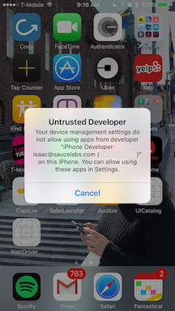

## 在 iOS 真机上运行 Appium

Appium 已支持真机的测试。

### 使用 Appium 运行你的测试

把设备的 udid 传给 `udid` 这个 capability。把应用的 bundle ID 传给 `app` 这个 capability，如果你的应用已经在手机上安装好了。如果应用未安装，那么需要将 `.ipa` 或者 `.app` 文件的路径传给 `app` 这个 capability。一旦你的设备和应用已经配置好，你就可以在那个设备上运行测试了。

### Desired Capabilities

通过在测试里使用以下的 capability，你可以在某个设备加载这个应用：

* `app` 或者 `bundleId` - 指定应用，或者如果应用已经安装到手机上了，只需简单地指定应用的 bundleID。这样 Appium 就可以加载该应用了。
* `udid` - 被测设备的 id。如果只有一台设备连接的时候，可以设置为 `auto`，Appium 能自动识别设备 id 并使用它。

更多的细节参考 [Appium server capabilities](/docs/cn/writing-running-appium/caps.md)

### 必备的软件

Appium iOS 真机支持依赖一个重要的第三方软件套件 [libimobiledevice](http://www.libimobiledevice.org/)，使用 [Homebrew](http://brew.sh/) 可以轻易地安装好。
```
brew install libimobiledevice
```

## 在 Xcode 7 和 iOS 9.3 或者以下，配置 iOS 真机设备测试

在 iOS 9.3 或者以下，使用 Xcode 7.3 或者以下对真机进行自动化 (比如，基于 Instruments 的测试) 需要相对较少的配置。主要就是需要你的应用是使用开发者证书签名的。 不幸的是，苹果移除了所有使用老版本 Xcode 的文档，不过你可以从[这里](https://medium.com/ios-os-x-development/ios-code-signing-provisioning-in-a-nutshell-d5b247760bef#.5hirl92tn)，[这里](https://engineering.nodesagency.com/articles/iOS/Understanding-code-signing-for-iOS-apps/)找到如何操作。

更详细地说， 在真机上开始测试, 你需要如下步骤：

* 一个 [Apple Developer ID](https://developer.apple.com/programs/ios/) 和一个有效的配置好开发者证书和 provisioning profile 的开发者账号。
* 要在真机上测试，一个有效的 iOS 开发证书和 Provisioning Profile 是必须的。被测应用也必须被签名。更多信息可以在 [Apple documentation](https://developer.apple.com/library/ios/documentation/IDEs/Conceptual/AppDistributionGuide/TestingYouriOSApp/TestingYouriOSApp.html) 找到。
* 一个苹果设备： iPad 或者 iPhone 都可以。确保已经在 Xcode 里已经配置好了开发机。
* 一个已经签名的 `.app` 或则 `.ipa` 文件，或者使用源码编一个。
* 一台 Mac 电脑，装好了 [Xcode](https://developer.apple.com/xcode/) 和 Xcode Command
Line Developer Tools。

Appium 使用 `ideviceinstaller` (`libimobiledevice` 套件的一部分)来处理应用安装问题。但是有时候使用 Xcode 提前安装好应用确保没有问题更加容易。(更多参考 [iOS deploy](ios-deploy.md))。

### 排障思路

0. 确保 UDID 是无误的，可以通过 Xcode Organizer 或者 iTunew 查看。留意 UDID 是很长的字符串（20+ 字符）。
0. 确保你可以在模拟器运行你的测试。
0. 重复确认通过 Instrumens 是否可以启动你的自动化。
0. 确保 Instruments 不在运行状态中。
0. 确保 UI Automation 在你的设备已经打开。设置 -> 开发者 -> 使用 UI Automation。

##  在 Xcode 8 和 iOS 9.3 以上配置 iOS 真机设备测试

作为对 `libimobiledevice` 依赖的补充，Appium 对 iOS 9.3 及以上和 Xcode 8 及以上的支持依赖 `ios-deploy`,
通过 [npm](https://www.npmjs.com/package/ios-deploy) 可以方便地安装：
```
npm install -g ios-deploy
```

不幸地是，苹果改变了以往的测试方法。新的方法需要安装一个帮助应用到设备上去，通过这个应用，自动化测试才能进行。说起来挺简单，但是代码签名和生成供开发和测试的应用，让人有一点头疼。

Appium 安装的应用叫 `WebDriverAgent-Runner` (可以在[这里](https://github.com/facebook/WebDriverAgent/))找到，要想安装这个应用，Appium需要能配置这个构建。

### 基本 (自动化) 配置

在 iOS 真机上设置和运行 Appium XCUItest，最方便的方法是使用自动化配置策略。有两种方式：

*   使用 `xcodeOrgId` 和 `xcodeSigningId` desired capabilities:
```json
    {
      "xcodeOrgId": "<Team ID>",
      "xcodeSigningId": "iPhone Developer"
    }
```
*   在你的文件系统里创建一个 `.xcconfig` 文件，内容是：
```
    DEVELOPMENT_TEAM = <Team ID>
    CODE_SIGN_IDENTITY = iPhone Developer
```
以上任何一个方式，Team ID 是一个 10 个字符长的字符串，苹果生成这个字符串，分配给你的团队。你可以在你的开发者账号里找到你的 Team ID。登录 [developer.apple.com/account](http://developer.apple.com/account)，然后点击边栏上的 Membership。你的 Team ID 在 Membership
Information 部分的团队名字下面。你也可以在 keychain 里的 iPhone 开发者证书里的 "Organizational Unit" 属性找到你的 Team ID。

注意这是互斥的策略；要么用 `xcodeConfigFile` capability， 要么用 `xcodeOrgId` and `xcodeSigningId` 的组合。

当以上的配置搞定后，只需再指定 `udid` capability 就可以在真机上开始测试了。

如果还是不工作的话，通常会在 Appium server 的日志里显示一些错误如：`info XCUITest xcodebuild exited with code '65' and signal 'null'`。这通常表示必要的代码签名没配置正确。 去看下 [Basic (manual) configuration](https://github.com/imurchie/appium-xcuitest-driver/blob/isaac-rs/docs/real-device-config.md#basic-manual-configuration)
这个文档，参试修复下。

如果 `WebDriverAgentRunner` 成功的在设备上安装好，但是在 Appium server 日志里还是有如下错误信息：
```
2017-01-24 09:02:18.358 xcodebuild[30385:339674] Error Domain=com.apple.platform.iphoneos Code=-12 "Unable to launch com.apple.test.WebDriverAgentRunner-Runner" UserInfo={NSLocalizedDescription=Unable to launch com.apple.test.WebDriverAgentRunner-Runner, NSUnderlyingError=0x7fa839cadc60 {Error Domain=DTXMessage Code=1 "(null)" UserInfo={DTXExceptionKey=The operation couldn’t be completed. Unable to launch com.apple.test.WebDriverAgentRunner-Runner because it has an invalid code signature, inadequate entitlements or its profile has not been explicitly trusted by the user. : Failed to launch process with bundle identifier 'com.apple.test.WebDriverAgentRunner-Runner'}}}
2017-01-24 09:02:18.358 xcodebuild[30385:339674] Error Domain=IDETestOperationsObserverErrorDomain Code=5 "Early unexpected exit, operation never finished bootstrapping - no restart will be attempted" UserInfo={NSLocalizedDescription=Early unexpected exit, operation never finished bootstrapping - no restart will be attempted}

Testing failed:
	Test target WebDriverAgentRunner encountered an error (Early unexpected exit, operation never finished bootstrapping - no restart will be attempted)
```
这个问题是因为开发者在这台设备上不被信任。如果你在设备上手动运行 `WebDriverAgentRunner`，你会看到一个错误页面弹出来：



你可以去设备中的 Settings => General => Device Management 信任这个开发者，允许 `WebDriverAgentRunner` 运行 (参考 [Apple
documentation for more information](https://support.apple.com/en-us/HT204460)).


### 基本 (手动) 配置

很多情况，基本的自动配置满足不了需求。这通常和真机运行上的代码签名和项目配置有关。这常常发生在免费的开发者账号上，免费的开发者账号不能创建 wildcard provisioning profile，也不能为应用创建默认的配置文件。

Xcode **创建 provisioning profile 失败** 的错误如下：


最容易的解决方案就是打开 [Xcode](https://developer.apple.com/xcode/)创建一个新工程：


类型不重要，只要是 "iOS"。用最简单的 "Single View Application" 即可：


重要的地方是要用唯一的 "Product Name" 和 "Organization Name". 然后，在这里，指定你的 "Team"。


你可以在 "Project" tab 确认 provisioning profile 是否创建成功。


或者去你的账号首选项里看看 provisioning profile：


现在你就有了一个有效的 provisioning profile。 记住你关联这个 profile 的 bundle id，然后放到 `updatedWDABundleId` 这个 desired capability 里。然后跟着[前面的自动配置教程](#basic-automatic-configuration)操作即可。


### 全部手动配置

另外，可以手动把 provisioning profile 和项目关联在一起。 (记住如果使用这个方法，每次 WebDriverAgent 更新，都要做一次。所以我们不推荐这个方法)：

*   找到你的 Appium 的安装目录
```
    $ which appium
    /path/where/installed/bin/appium
```
*   假设安装目录是： `/path/where/installed/bin/appium`，那么 `WebDriverAgent`
    在 `/path/where/installed/lib/node_modules/appium/node_modules/appium-xcuitest-driver/WebDriverAgent`。
    打开终端到那个目录，然后按以下命令操作：
```
    mkdir -p Resources/WebDriverAgent.bundle
    ./Scripts/bootstrap.sh -d
```
*   在 Xcode 里打开 `WebDriverAgent.xcodeproj`。 对于 `WebDriverAgentLib`
    和 `WebDriverAgentRunner` 两个 target，都选择 "General" tab 里的 "Automatically manage signing"
    然后选择你的 `Development Team`。这也会自动选择 `Signing Ceritificate`。大概的样子如下：

    

    * Xcode 可能会创建不了 `WebDriverAgentRunner` 的 provisioning profile：

      

    * 这时候需要在 "Build Settings" tab 里手动改 bundle id。把 "Product Bundle Identifier"
      从 `com.facebook.WebDriverAgentRunner` 改成 Xcode 能采用的：

      

    * 在回到 "General" tab 里的 `WebDriverAgentRunner` target，现在你可以看到一个 provisioning profile 创建成果了:

      

*   最后，你可以验证一切都 OK 了。 构建这个项目：
```
    xcodebuild -project WebDriverAgent.xcodeproj -scheme WebDriverAgentRunner -destination 'id=<udid>' test
```
如果成果了，最后的输出会像下面这样：
```
    Test Suite 'All tests' started at 2017-01-23 15:49:12.585
    Test Suite 'WebDriverAgentRunner.xctest' started at 2017-01-23 15:49:12.586
    Test Suite 'UITestingUITests' started at 2017-01-23 15:49:12.587
    Test Case '-[UITestingUITests testRunner]' started.
        t =     0.00s     Start Test at 2017-01-23 15:49:12.588
        t =     0.00s     Set Up
```
*   要完整验证的话，你可以试试看访问 WebDriverAgent server 的状态 (**注意：** 你必须和手机设备同一个网段，你可以从 Settings => Wi-Fi => Current Network 找到手机当前的 IP。):
```
    export DEVICE_URL='http://<device IP>:8100'
    export JSON_HEADER='-H "Content-Type: application/json;charset=UTF-8, accept: application/json"'
    curl -X GET $JSON_HEADER $DEVICE_URL/status
```
    你会得到如下输出：
```
    {
      "value" : {
        "state" : "success",
        "os" : {
          "name" : "iOS",
          "version" : "10.2"
        },
        "ios" : {
          "simulatorVersion" : "10.2",
          "ip" : "192.168.0.7"
        },
        "build" : {
          "time" : "Jan 23 2017 14:59:57"
        }
      },
      "sessionId" : "8951A6DD-F3AD-410E-A5DB-D042F42F68A7",
      "status" : 0
    }
```
