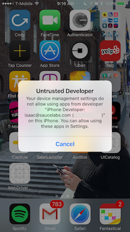
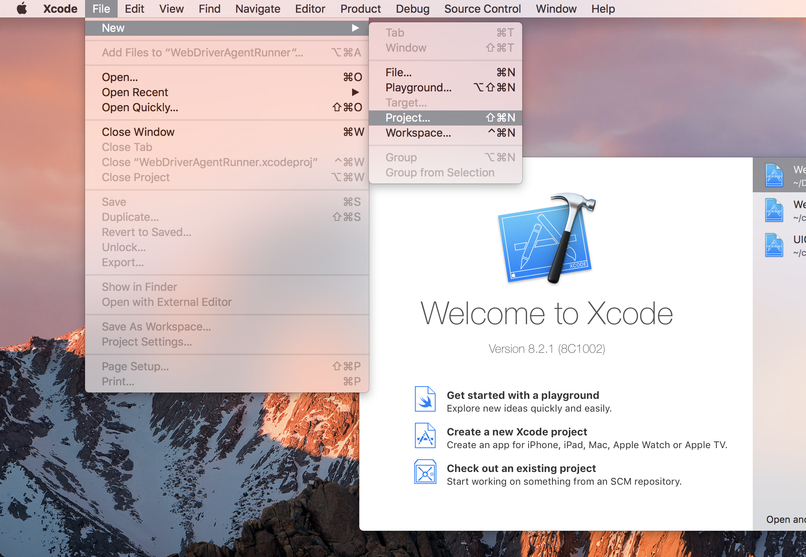
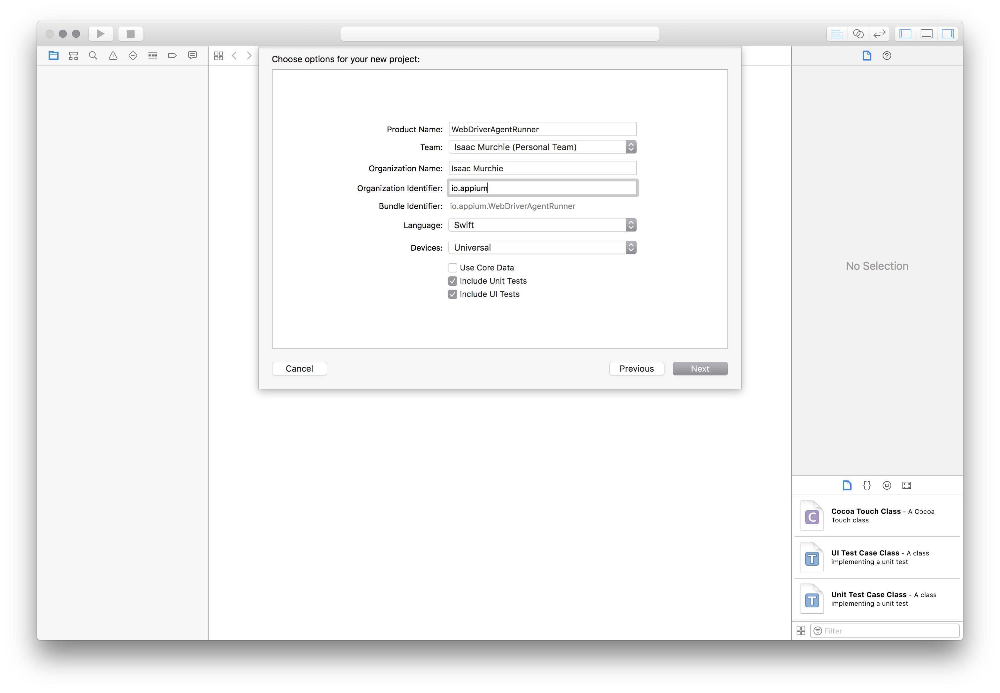
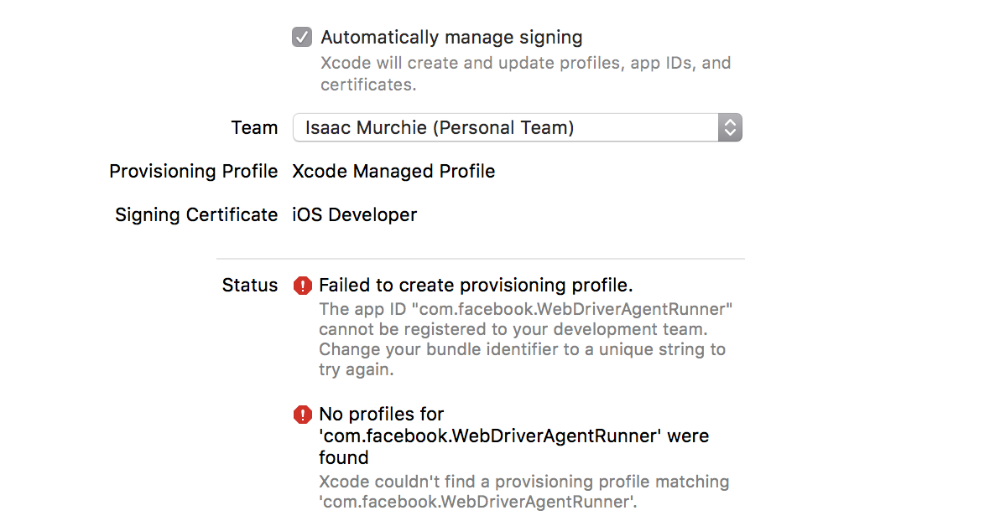
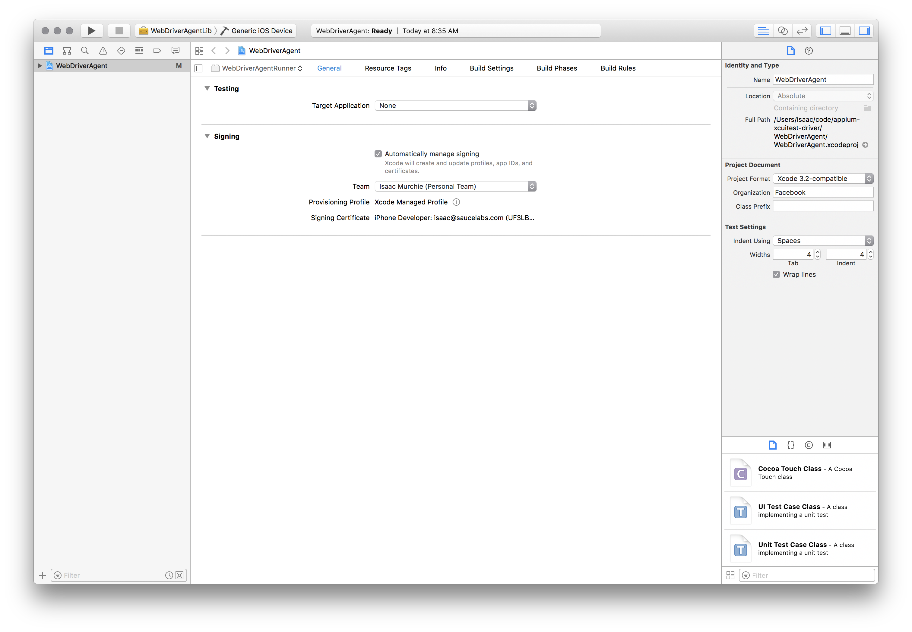

## Appium XCUITest 驱动在真机上的设置

### 安装依赖

自 Appium 1.15.0 起，Appium 与真机设备通过 [appium-ios-device](https://github.com/appium/appium-ios-device) 进行联通。您不需要再额外安装依赖项。XCUITest 驱动会安装一个名为 `WebDriverAgent-Runner` 的辅助软件在设备上，并通过这个辅助软件控制被测应用。虽然这听起来很简单，但在苹果软件的代码签名和配置应用程序上，在开发和测试中可能会有些头痛。
应该可以从Xcode中找到待测设备。请确保被测设备连接Xcode万无一失。你可以通过打开 _Devices and Simulators_ 这个选项栏来确认这件事。

这篇文章也有利于解决环境依赖安装的问题 [appium-xcuitest-driver](https://github.com/appium/appium-xcuitest-driver) 。


### 基础 (自动) 配置

在 iOS 真机上使用 XCUITest 运行自动化测试最简单的方法，就是使用自动配置来运行。这里有两条路：

*   使用功能参数 `xcodeOrgId` 与 `xcodeSigningId` :
```json
    {
      "xcodeOrgId": "<Team ID>",
      "xcodeSigningId": "iPhone Developer"
    }
```
*   在任意路径下，创建一个 `.xcconfig` 文件，并添加如下配置：
```
    DEVELOPMENT_TEAM = <Team ID>
    CODE_SIGN_IDENTITY = iPhone Developer
```

无论哪种情况，苹果公司会生成一个 10 位字符的唯一字符串作为您的 Team ID，分配给您的开发团队。您可以您的开发者账号找到这个 Team ID，您可以登录[developer.apple.com/account](http://developer.apple.com/account) 并点击侧边栏的 「开发者资格（ Membership ）」。您可以在 「开发者资格（ Membership ）」 详细信息的团队名称下找到您的 Team ID。您也可以在您电脑「钥匙串」中的 iPhone 开发者证书中的 「组织单元（"Organizational Unit"）」字段中，找到您的 Team ID。

需要注意的是，使用 `xcodeConfigFile` 这种方式，与使用 `xcodeOrgId` 和 `xcodeSigningId` 的方式是互斥的。

这些配置完成后，您就只剩下将您的真机设备配置在参数 `udid` 中就可以了。

如果配置完无法运行，一般会在 Appium 服务日志中有对应的报错信息，比如有些会提示：`info XCUITest xcodebuild exited with code '65' and
signal 'null'`。这通常意味着代码签名配置的有问题。继续回看上一部分[基础 (自动) 配置](#basic-manual-configuration)来解决这个问题。

如果 `WebDriverAgentRunner` 在真机设备上安装成功，但是 Appium 服务日志有如下报错：
```
2017-01-24 09:02:18.358 xcodebuild[30385:339674] Error Domain=com.apple.platform.iphoneos Code=-12 "Unable to launch com.apple.test.WebDriverAgentRunner-Runner" UserInfo={NSLocalizedDescription=Unable to launch com.apple.test.WebDriverAgentRunner-Runner, NSUnderlyingError=0x7fa839cadc60 {Error Domain=DTXMessage Code=1 "(null)" UserInfo={DTXExceptionKey=The operation couldn’t be completed. Unable to launch com.apple.test.WebDriverAgentRunner-Runner because it has an invalid code signature, inadequate entitlements or its profile has not been explicitly trusted by the user. : Failed to launch process with bundle identifier 'com.apple.test.WebDriverAgentRunner-Runner'}}}
2017-01-24 09:02:18.358 xcodebuild[30385:339674] Error Domain=IDETestOperationsObserverErrorDomain Code=5 "Early unexpected exit, operation never finished bootstrapping - no restart will be attempted" UserInfo={NSLocalizedDescription=Early unexpected exit, operation never finished bootstrapping - no restart will be attempted}

Testing failed:
	Test target WebDriverAgentRunner encountered an error (Early unexpected exit, operation never finished bootstrapping - no restart will be attempted)
```
这个问题是由于开发者在设备上不受信任，当你手动尝试将 `WebDriverAgentRunner` 安装在您的真机设备上时，会看到如下弹窗信息：



您可以通过 设置（Settings） => 通用（General） => 设备管理（Device Management）来信任开发者，以使 `WebDriverAgentRunner` 能够成功运行 (更多详细信息见： [苹果官方支持文档](https://support.apple.com/en-us/HT204460))。


### 基础 (手动) 配置

在很多情况下，基本的自动配置是不满足使用需要的。通常在自动化运行时，会有代码签名和项目配置的问题。当正在使用的开发帐户是“免费”帐户时，无法创建出通用的配置文件。

这通常表现为 Xcode 报错为：**failed to create
provisioning profile**:


解决此问题的最简单方法是通过打开 [Xcode](https://developer.apple.com/xcode/) 并创建一个新项目来创建配置文件 ：



只要选择了 "iOS"，具体的应用类型无关紧要，一般使用单页面应用 （"Single View Application"）最简单也最方便：


重要的是，使用一个唯一的 产品名称（"Product Name"）与 组织名称（"Organization Name"），并且，在这时候，请选择你的团队（"Team"）。



您可以通过查看 "项目" 选项，来确认配置文件是否已创建：


或者通过进入您的帐户首选项并查看配置文件：


此时，您有一个有效的配置文件。记住 bundle id 并添加到测试的 `updatedWDABundleId` 功能参数中。然后按照 [如何初始化自动配置](#basic-automatic-configuration).


### 完全手工配置

或者，配置文件可以完全通过手工在项目中配置（需要知道的是，每次WDA更新、Appium更新时，都需要操作一次，_不推荐_ ）：

*   找到您 Appium 的安装路径:
```
    $ which appium
    /path/where/installed/bin/appium
```
*   由于路径在： `/path/where/installed/bin/appium`，那么，`WebDriverAgent` 可以在这个路径的下级路径中被找到： `/path/where/installed/lib/node_modules/appium/node_modules/appium-webdriveragent`。
    打开终端（terminal），移动到该路径下执行如下命令：
```
    mkdir -p Resources/WebDriverAgent.bundle
```
*  ( 如果 Appium 版本低于 1.20 ) 在终端（terminal）执行如下命令：
```
    ./Scripts/bootstrap.sh -d
```
*   Xcode 打开 `WebDriverAgent.xcodeproj`。同时选中  `WebDriverAgentLib`
    and `WebDriverAgentRunner` ，在 通用（"General"）页签下，都选择为自动管理签名（"Automatically manage signing"），然后选择您所在的开发组织（`Development Team`），它将自动选择开发者签名证书（`Signing Ceritificate`）。结果应如下所示：

    

    * Xcode 可能无法为 `WebDriverAgentRunner` 创建配置文件：

      

    * 这需要通过进入构建设置（"Build Settings"）页签下，手动更改目标的bundle id，并且将构建产物标识符（"Product Bundle Identifier"）`com.facebook.WebDriverAgentRunner` 进行一些修改，以让 Xcode 通过：

      

    * Going back to the "General" tab for the `WebDriverAgentRunner` target, you
      should now see that it has created a provisioning profile and all is well:
      返回 `WebDriverAgentRunner` 的通用（"General"）页签，您将看到配置文件已经创建完成，并且所有配置都是正常的了：

      

*   最后，您可以验证一切是否正常。构建项目：
```
    xcodebuild -project WebDriverAgent.xcodeproj -scheme WebDriverAgentRunner -destination 'id=<udid>' test
```
如果一切正常，输出信息一般以此结尾:
```
    Test Suite 'All tests' started at 2017-01-23 15:49:12.585
    Test Suite 'WebDriverAgentRunner.xctest' started at 2017-01-23 15:49:12.586
    Test Suite 'UITestingUITests' started at 2017-01-23 15:49:12.587
    Test Case '-[UITestingUITests testRunner]' started.
        t =     0.00s     Start Test at 2017-01-23 15:49:12.588
        t =     0.00s     Set Up
```
*   要完全验证，您可以尝试访问 WebDriverAgent 服务器状态
    (**提示:** 您 _必须_ 保证 WebDriverAgent 服务与设备在同一网络下，可以通过以下方式获取 IP， Settings => Wi-Fi => Current Network):
```
    export DEVICE_URL='http://<device IP>:8100'
    export JSON_HEADER='-H "Content-Type: application/json;charset=UTF-8, accept: application/json"'
    curl -X GET $JSON_HEADER $DEVICE_URL/status
```
  您将获得类似如下的返回信息:

```
    {
      "value" : {
        "state" : "success",
        "os" : {
          "name" : "iOS",
          "version" : "10.2"
        },
        "ios" : {
          "simulatorVersion" : "10.2",
          "ip" : "192.168.0.7"
        },
        "build" : {
          "time" : "Jan 23 2017 14:59:57"
        }
      },
      "sessionId" : "8951A6DD-F3AD-410E-A5DB-D042F42F68A7",
      "status" : 0
    }
```

### 对被测应用的设置

不仅是 WDA 可以在您的设备上运行，被测应用也需要可以在您的设备上运行。它们之间的规则是相同的：一个拥有签名的被测应用（ 一个 `.ipa` 文件）。 可以在 这里 [这里](https://medium.com/ios-os-x-development/ios-code-signing-provisioning-in-a-nutshell-d5b247760bef#.5hirl92tn)
与 
[这里](https://www.nodesagency.com/understanding-code-signing-for-ios-apps) 找到更详细的描述。

更详细地说，要使用真机运行自动化测试，您需要以下内容：

* 一个 [苹果开发者ID](https://developer.apple.com/programs/ios/) 和一个有效的开发者帐户，以及一个配置好的开发证书和配置文件。（请确保配置文件具有[iOS Distribution](https://developer.apple.com/support/certificates/)类型）

* 如果需要在真机运行测试，一个合法的 iOS 开发者证书和配置文件是必须有的。您的 App 也需要签名。您可以在这里看到更多信息：[苹果官方文档](https://developer.apple.com/library/ios/documentation/IDEs/Conceptual/AppDistributionGuide/TestingYouriOSApp/TestingYouriOSApp.html)。

* 一台 iPad 或 iPhone设备。请确保在 Xcode 中可以找到它们。

* 一个拥有签名的 `.app` 或 `.ipa` 被测 App 应用，或者是它们可以被构建的源代码。

* 一台拥有 [Xcode](https://developer.apple.com/xcode/) 与 Xcode 开发者命令行工具的 Mac 系统的电脑。

Appium 将通过 `ideviceinstaller` (`libimobiledevice` 的一部分功能) 将应用安装到设备上，但有时候，通过 Xcode 预安装会更加方便（再看看这个：[苹果官方文档](https://developer.apple.com/library/content/documentation/IDEs/Conceptual/AppDistributionGuide/TestingYouriOSApp/TestingYouriOSApp.html)）


### 问题排查思路

1. 请通过 Xcode Organizer 或 iTunes 确保设备 UDID 是正确的。 它是一个 20+ 的字符串。
1. 请确保相同操作在模拟器上是可以运行的。
1. 请确保在设备上 **启动** 了以下设置:
    1. 设置（Settings） -> 开发者（Developer） -> **启动 UI Automation （Enable UI Automation）**
    1. 设置（Settings） -> Safari -> 高级（Advanced） -> **Web Inspector** 与 **Remote Automation**
        1. 请阅读 [Automating mobile web apps](/writing-running-appium/web/mobile-web) 获取关于 WebView 运行的详细信息。
1. 如果您不想为手动配置配置文件，请在自动生成时带上 `.xctrunner` 标识。`.xctrunner` 在 Xcode 11. [A reference](https://github.com/appium/appium/issues/13610) 起，将被自动配置。

1. 请确保设备没有越狱
    - `com.apple.mobile.installation_proxy` 服务在管理 App 上[不起作用](https://github.com/appium/appium-desktop/issues/1447)

1. 确保配置文件具有：[_iOS 分发证书_](https://developer.apple.com/support/certificates/)
    - 由于 Apple 的安全设计，活动 Xcode/xcodebuild 连接/会话是与 WebDriverAgentRunner 交互所必需需要的。 证书限制的影响： ([issue](https://github.com/appium/appium/issues/14577#issuecomment-660997827))
