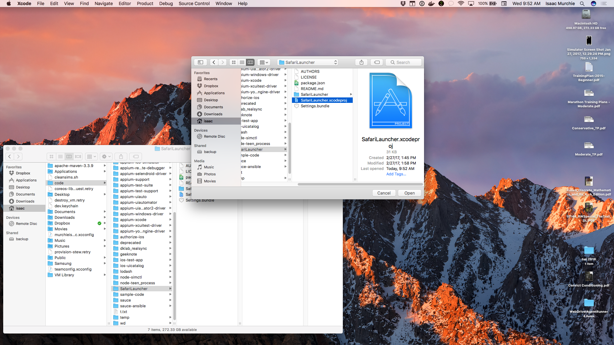
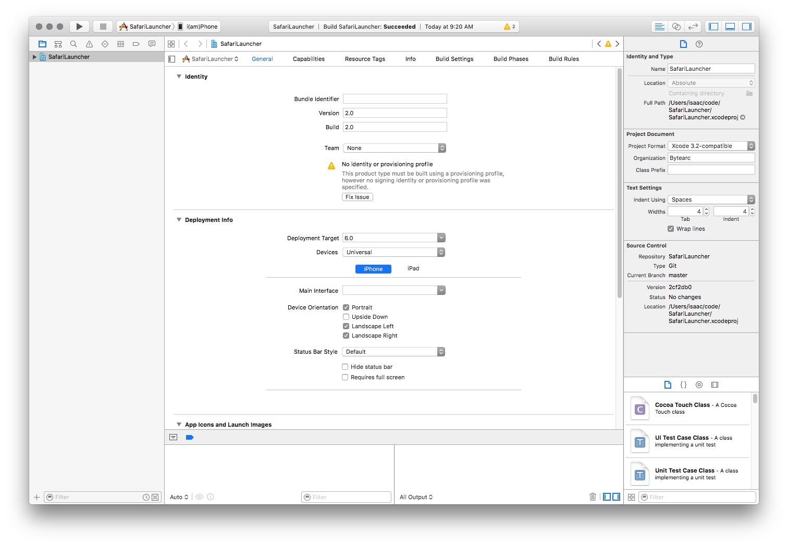
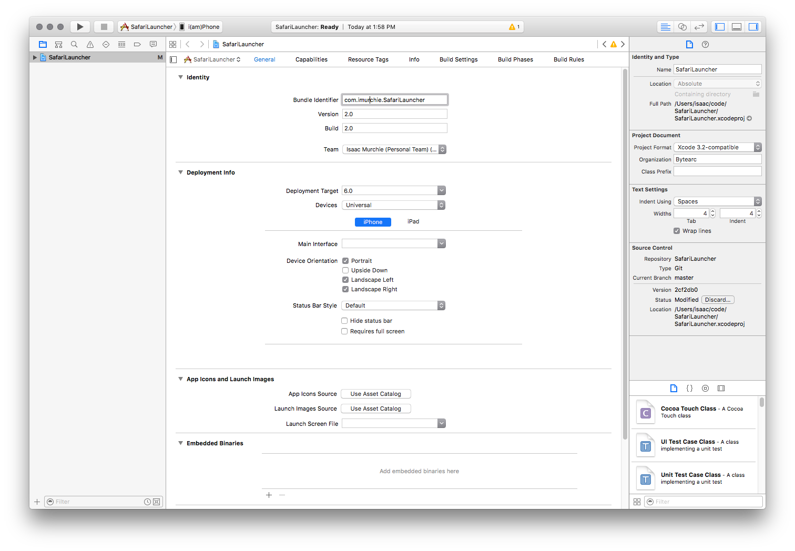

## 在 iOS 9.3 及以下版本的真机上运行移动 web 测试：SafariLauncher

在 iOS 9.3 或更低版本的 iOS 真实设备上运行移动 web 测试需要引入第三方应用程序[SafariLauncher](https://github.com/snevesbarros/SafariLauncher)。 这是必要的，因为 Instruments 没有办法在设备上启动Safari 应用程序。只有先启动 SafariLauncher 应用程序，然后才能启动Safari。简单！


In some configurations, Appium is able to automatically build, sign, and install
`SafariLauncher` as it needs, and there is nothing else necessary to be done. If,
however, this is not the case, as is more often so with later versions of
[Xcode](https://developer.apple.com/xcode/), the following configuration needs to
be done before Safari tests on real devices can be successfully run.

在某些配置中，Appium 能够根据需要自动构建，签名和安装 SafariLauncher，没有什么额外要做的。 但是，事实并非如此，随着[Xcode](https://developer.apple.com/xcode/)的版本更新更为常见。想要在真实设备上的 Safari 上成功运行自动化测试，需要完成以下配置。

### 自动配置SafariLauncher

The only thing needed for automatic `SafariLauncher` configuration is to create
a **provisioning profile** that can be used to deploy the `SafariLauncher` App.
This requires, in particular, a wildcard certificate, which is not possible if
your Apple developer account is a free one. If that is the case, skip to the
manual configuration below.

自动配置 SafariLauncher 唯一需要做的是创建一个可用于部署 SafariLauncher App 的**配置文件**。 这需要一个通配符证书。但是如果您的Apple开发者帐户是免费的，这是不可能的。 如果是这种情况，请跳转到下面的手动配置内容。

要创建启动器的配置文件，请进入**Apple Developers会员中心**，按如下步骤操作：

步骤1：创建一个新的**APP ID**，并选择WildCard APP ID选项，将其设置为“ * ”
步骤2：创建一个**新的开发配置文件**，App Id选择在步骤1中创建的。
步骤3：选择您的**证书和设备**，然后单击下一步。
步骤4：设置配置文件名称并**生成配置文件**。
步骤5：下载配置文件并用文本编辑器打开。
步骤6：搜索**UUID**及其字符串作为您的**身份代码**。

现在只需将您的UDID和设备名称包含在您所需的功能中：

```js
{
  udid: '...',
  deviceName: '...',
  platformName: 'iOS',
  platformVersion: '9.3',
  browserName: 'Safari'
}
```

### 手动配置 SafariLauncher

**注意：** 此过程假定您已经安装[Xcode](https://developer.apple.com/xcode/)7.3或7.3.1。

可以使用 [appium-ios-driver](https://github.com/appium/appium-ios-driver) 附带的 [SafariLauncher](https://github.com/snevesbarros/SafariLauncher) 版本，但如果这样做，每次更新Appium时，必须重新执行该过程。

要获取 `SafariLauncher` 的本地副本，请先从 [GitHub](https://github.com/) 克隆它：

```bash
git clone https://github.com/snevesbarros/SafariLauncher.git
```

一旦您拥有 `SafariLauncher` 的源代码的本地副本，请打开 [Xcode](https://developer.apple.com/xcode/)，然后打开 `SafariLauncher` 项目



在 `SafariLauncher` target 窗口中，您会看到一个错误，表示需要有一个此 app 的配置文件



为了解决这个问题，您首先需要为app输入“Bundle Identifier”。 Appium期望的默认值为com.bytearc.SafariLauncher，但这可能无法用于构建。 在这种情况下，请选择其他的东西，并记下它。 然后选择“Team”，并允许创建配置文件



最后，确保您的设备已连接到计算机，并将其选为目标设备


并运行构建和安装操作来编译app并将其推送到您的设备上


现在你的设备上有一个可用的 `SafariLauncher`。 该app本身是一个简单的屏幕，点击一个按钮将启动 `Safari`


如果您选择了与默认（com.bytearc.SafariLauncher）不同的app的软件包标识符，则最后一步是必需的。 如果你这样做，在使用bundleId所需的功能创建会话时，需要将它发送到Appium：

```js
{
  udid: '...',
  deviceName: '...',
  platformName: 'iOS',
  platformVersion: '9.3',
  browserName: 'Safari',
  bundleId: 'com.imurchie.SafariLauncher'
}
```

本文由 [高鹏](https://testerhome.com/026) 翻译，由 [lihuazhang](https://github.com/lihuazhang) 校验。