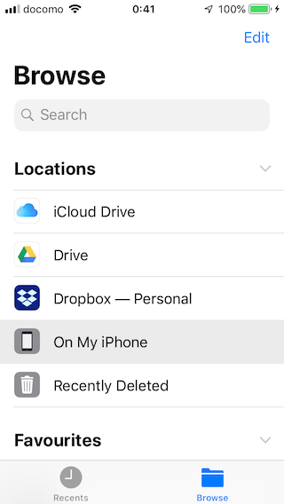
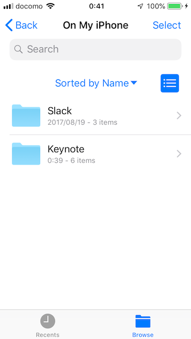
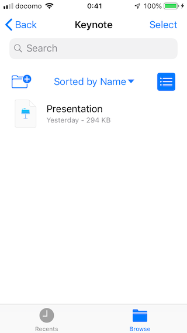

## Pushing/Pulling files

Appium provides [Pull Folder](http://appium.io/docs/en/commands/device/files/pull-folder/), [Pull File](http://appium.io/docs/en/commands/device/files/pull-file/) and [Push File](http://appium.io/docs/en/commands/device/files/push-file/) to move files.
This documentation aims to help to understand how they work for iOS since iOS is a bit complicated.

### Format

In iOS case, below is the basic format.

1. `@<app_bundle_id>:<optional_container_type>/<path_to_the_file_or_folder_inside_container>`
2. `@<app_bundle_id>/<path_to_the_file_or_folder_inside_container>`
3. `<path_to_the_file_or_folder_inside_container>`

### Real device

For real devices, Appium relies on [ifuse](https://github.com/libimobiledevice/ifuse) to achieve the feature.
You may compile ifuse from the source code or via brew.

```
$ brew cask install osxfuse
$ brew install ifuse --HEAD # newer iOS versions need the latest codebase
```

#### Format

The format of method argument should be the following:

- `@<app_bundle_id>` is a bundle id.
- `optional_container_type` is container type
    - `documents` is only available. Others work as _format 2_
        - BundleIds which can get by `ifuse -u <udid> --list-apps` can specify `documents` type
        - e.g. Below _On My iPhone_ image has _Slack_ folder, but `com.tinyspeck.chatlyio` does not exist in the output of `--list-apps`. Thus, we cannot mount it as `com.tinyspeck.chatlyio@documents/appium.png`
    - No case (Other container types are also handles as no case), _format 2_ or _format 1_
        - Can be mounted apps which have `UIFileSharingEnabled` flag in its `info.plist`
- `path_to_the_file_or_folder_inside_container` is the target to push/pull to/from them.
    - If the `optional_container_type` is `documents`, this path will be mapped to
      `On My iPhone/<app name>` in Files app

_format 3_ is not allowed for real devices.

#### Example

If you would like to pull _Presentation.key_ form Keynote app, you can get it as below.

- Pull file

```javascript
// webdriver.io
let data = driver.pullFile('@io.appium.example:documents/Presentation.key');
```

```ruby
# ruby_lib_core
file = @driver.pull_file '@com.apple.Keynote:documents/Presentation.key'
File.open('presentation.key', 'wb') { |f| f<< file }
```

The file is in _On My iPhone/Keynote_ on Files app.

|Top | On  My iPhone | Keynote |
|:----:|:----:|:----:|
||||

If the file is in deeper place like _On My iPhone/Keynote/Dir1/Dir2_, then the Ruby command should be:

```javascript
// webdriver.io
let data = driver.pullFile('@io.appium.example:documents/Dir1/Dir2/Presentation.key');
```

```ruby
# ruby_lib_core
file = @driver.pull_file '@com.apple.Keynote:documents/Dir1/Dir2/Presentation.key'
File.open('presentation.key', 'wb') { |f| f<< file }
```

- Pull folder

You can pull root of _On My iPhone/Keynote_ as `@driver.pull_folder '@com.apple.Keynote:documents/'`.

```javascript
// webdriver.io
let data = driver.pullFolder('@io.appium.example:documents/');
```

```ruby
# ruby_lib_core
file = @driver.pull_folder '@com.apple.Keynote:documents/'
```

- Push file

As same as pull files

```javascript
// webdriver.io
driver.pushFile('@com.apple.Keynote:documents/text.txt', new Buffer("Hello World").toString('base64'));
```

```ruby
# ruby_lib_core
@driver.push_file '@com.apple.Keynote:documents/text.txt', (File.read 'path/to/file')
```

### Simulator

#### Format

The format of method argument should be the following:

- `@<app_bundle_id>` is a bundle id.
- `optional_container_type` is container type
    - `app`, `data`, `groups` or `<A specific App Group container>`
    - _format 2_ case is handled as `app` container
- `path_to_the_file_or_folder_inside_container` is the target to push/pull to/from them

_format 3_ format handles as `app` container

#### Example

```java
// Java
// Get AddressBook.sqlitedb in test app package ('app' container)
byte[] fileBase64 = driver.pullFile("Library/AddressBook/AddressBook.sqlitedb");
```

### references
- https://stackoverflow.com/questions/1108076/where-does-the-iphone-simulator-store-its-data
- https://stackoverflow.com/questions/48884248/how-can-i-add-files-to-the-ios-simulator
- https://apple.stackexchange.com/questions/299413/how-to-allow-the-files-app-to-save-to-on-my-iphone-or-to-on-my-ipad-in-ios/299565#299565
