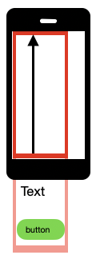

## Android 'UIScrollable' swipe: Simple example

UIScrollable is powerful Android class that searching elements in
scrollable layout. In most cases you should use "scrollIntoView" class
which performs scroll action until needed element will be found on
screen.

Android developer
[documentation](https://developer.android.com/reference/androidx/test/uiautomator/UiScrollable)
for UIScrollable.

We can use it with following:
- elements in list (e.g. country list)
- any element outside screen (e.g. input field, text or button)

ScrollIntoView has UiSelector, as search criteria input, that allows you
to find elements by:
- by text (exact, contains, match, starts with or regex)
- id (exact or regex)
- some other methods (less used) see in Android developer documentation
- combination of available search methods

Android developer
[documentation](https://developer.android.com/reference/androidx/test/uiautomator/UiSelector)
for UiSelector.

With simple example we assume that we have one scrolling view and scroll
direction from bottom to top screen.



### Search by text

```java
// Page object
@AndroidFindBy(uiAutomator = "new UiScrollable(new UiSelector().scrollable(true))" +
        ".scrollIntoView(new UiSelector().text(\"exact_text\"))")
MobileElement element;

@AndroidFindBy(uiAutomator = "new UiScrollable(new UiSelector().scrollable(true))" +
        ".scrollIntoView(new UiSelector().textContains(\"part_text\"))")
MobileElement element;

// FindElement
MobileElement element = (MobileElement) driver.findElement(MobileBy.AndroidUIAutomator(
        "new UiScrollable(new UiSelector().scrollable(true))" +
         ".scrollIntoView(new UiSelector().text(\"exact_text\"))"));

MobileElement element = (MobileElement) driver.findElement(MobileBy.AndroidUIAutomator(
        "new UiScrollable(new UiSelector().scrollable(true))" +
         ".scrollIntoView(new UiSelector().textContains(\"part_text\"))"));
```

### Search by id

```java
// Page object
@AndroidFindBy(uiAutomator = "new UiScrollable(new UiSelector().scrollable(true))" +
        ".scrollIntoView(new UiSelector().resourceIdMatches(\".*part_id.*\"))")
MobileElement element;

// FindElement
MobileElement element = (MobileElement) driver.findElement(
        MobileBy.AndroidUIAutomator("new UiScrollable(new UiSelector().scrollable(true))" +
         ".scrollIntoView(new UiSelector().resourceIdMatches(\".*part_id.*\"))"));

```

### Search by id and text

```java
// Page object
@AndroidFindBy(uiAutomator = "new UiScrollable(new UiSelector().scrollable(true))" +
        ".scrollIntoView(new UiSelector().resourceIdMatches(\".*part_id.*\").text(\"exact_text\"))")
MobileElement element;

// FindElement
MobileElement element = (MobileElement) driver.findElement(
        MobileBy.AndroidUIAutomator("new UiScrollable(new UiSelector().scrollable(true))" +
         ".scrollIntoView(new UiSelector().resourceIdMatches(\".*part_id.*\").text(\"exact_text\"))"));

```


### Long view problem

With some long views we need to increase "setMaxSearchSwipes". This
value sets search swipes tries after which search will be stopped.

```java
// set max swipes to 10
// FindElement
MobileElement element = (MobileElement) driver.findElement(
        MobileBy.AndroidUIAutomator("new UiScrollable(new UiSelector().scrollable(true)).setMaxSearchSwipes(10)" +
         ".scrollIntoView(new UiSelector().text(\"exact_text\"))"));

```

