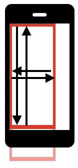

## Simple Element swipe

### Android: UIAutomator2

With UIAutomator2 driver, by default, we see only elements on screen. If
an elements container covers the area inside and outside of the current
view port then a part of its content won't be visible.



```java
/**
 * Performs swipe inside an element
 *
 * @param el  the element to swipe
 * @param dir the direction of swipe
 * @version java-client: 7.3.0
 **/
public void swipeElementAndroid(MobileElement el, Direction dir) {
    System.out.println("swipeElementAndroid(): dir: '" + dir + "'"); // always log your actions

    // Animation default time:
    //  - Android: 300 ms
    //  - iOS: 200 ms
    // final value depends on your app and could be greater
    final int ANIMATION_TIME = 200; // ms

    final int PRESS_TIME = 200; // ms

    int edgeBorder;
    PointOption pointOptionStart, pointOptionEnd;

    // init screen variables
    Rectangle rect = el.getRect();
    // sometimes it is needed to configure edgeBorders
    // you can also improve borders to have vertical/horizontal
    // or left/right/up/down border variables
    edgeBorder = 0;

    switch (dir) {
        case DOWN: // from up to down
            pointOptionStart = PointOption.point(rect.x + rect.width / 2,
                    rect.y + edgeBorder);
            pointOptionEnd = PointOption.point(rect.x + rect.width / 2,
                    rect.y + rect.height - edgeBorder);
            break;
        case UP: // from down to up
            pointOptionStart = PointOption.point(rect.x + rect.width / 2,
                    rect.y + rect.height - edgeBorder);
            pointOptionEnd = PointOption.point(rect.x + rect.width / 2,
                    rect.y + edgeBorder);
            break;
        case LEFT: // from right to left
            pointOptionStart = PointOption.point(rect.x + rect.width - edgeBorder,
                    rect.y + rect.height / 2);
            pointOptionEnd = PointOption.point(rect.x + edgeBorder,
                    rect.y + rect.height / 2);
            break;
        case RIGHT: // from left to right
            pointOptionStart = PointOption.point(rect.x + edgeBorder,
                    rect.y + rect.height / 2);
            pointOptionEnd = PointOption.point(rect.x + rect.width - edgeBorder,
                    rect.y + rect.height / 2);
            break;
        default:
            throw new IllegalArgumentException("swipeElementAndroid(): dir: '" + dir + "' NOT supported");
    }

    // execute swipe using TouchAction
    try {
        new TouchAction(driver)
                .press(pointOptionStart)
                // a bit more reliable when we add small wait
                .waitAction(WaitOptions.waitOptions(Duration.ofMillis(PRESS_TIME)))
                .moveTo(pointOptionEnd)
                .release().perform();
    } catch (Exception e) {
        System.err.println("swipeElementAndroid(): TouchAction FAILED\n" + e.getMessage());
        return;
    }

    // always allow swipe action to complete
    try {
        Thread.sleep(ANIMATION_TIME);
    } catch (InterruptedException e) {
        // ignore
    }
}
```

### iOS: XCUITest

XCUITest shows elements outside screen. It is strongly advised to use
either screen swipe or 'mobile:scroll' / 'mobile:swipe' methods. If you
still need or prefer to try element method you should consider the
following:
1. Check that both start and end points are on screen.
2. Scrollview is often a background element. Any header/footer or other
   elements overlap it and limit swipe possibilities. Try to fix it by
   configuring correct borders. If borders differ per screen - make them
   configurable via swipe function variables.

```java
/**
 * Performs swipe inside an element
 *
 * @param el  the element to swipe
 * @param dir the direction of swipe
 * @version java-client: 7.3.0
 **/
public void swipeElementIOS(MobileElement el, Direction dir) {
    System.out.println("swipeElementIOS(): dir: '" + dir + "'"); // always log your actions

    // Animation default time:
    //  - Android: 300 ms
    //  - iOS: 200 ms
    // final value depends on your app and could be greater
    final int ANIMATION_TIME = 200; // ms

    final int PRESS_TIME = 200; // ms

    int leftBorder, rightBorder, upBorder, downBorder;
    PointOption pointOptionStart, pointOptionEnd;

    // init screen variables
    Dimension dims = driver.manage().window().getSize();
    Rectangle rect = el.getRect();

    // check element overlaps screen
    if (rect.x >= dims.width || rect.x + rect.width <= 0
            || rect.y >= dims.height || rect.y + rect.height <= 0) {
        throw new IllegalArgumentException("swipeElementIOS(): Element outside screen");
    }

    // init borders per your app screen
    // or make them configurable with function variables
    leftBorder = 0;
    rightBorder = 0;
    upBorder = 0;
    downBorder = 0;

    // find rect that overlap screen
    if (rect.x < 0) {
        rect.width = rect.width + rect.x;
        rect.x = 0;
    }
    if (rect.y < 0) {
        rect.height = rect.height + rect.y;
        rect.y = 0;
    }
    if (rect.width > dims.width)
        rect.width = dims.width;
    if (rect.height > dims.height)
        rect.height = dims.height;

    switch (dir) {
        case DOWN: // from up to down
            pointOptionStart = PointOption.point(rect.x + rect.width / 2,
                    rect.y + upBorder);
            pointOptionEnd = PointOption.point(rect.x + rect.width / 2,
                    rect.y + rect.height - downBorder);
            break;
        case UP: // from down to up
            pointOptionStart = PointOption.point(rect.x + rect.width / 2,
                    rect.y + rect.height - downBorder);
            pointOptionEnd = PointOption.point(rect.x + rect.width / 2,
                    rect.y + upBorder);
            break;
        case LEFT: // from right to left
            pointOptionStart = PointOption.point(rect.x + rect.width - rightBorder,
                    rect.y + rect.height / 2);
            pointOptionEnd = PointOption.point(rect.x + leftBorder,
                    rect.y + rect.height / 2);
            break;
        case RIGHT: // from left to right
            pointOptionStart = PointOption.point(rect.x + leftBorder,
                    rect.y + rect.height / 2);
            pointOptionEnd = PointOption.point(rect.x + rect.width - rightBorder,
                    rect.y + rect.height / 2);
            break;
        default:
            throw new IllegalArgumentException("swipeElementIOS(): dir: '" + dir + "' NOT supported");
    }

    // execute swipe using TouchAction
    try {
        new TouchAction(driver)
                .press(pointOptionStart)
                // a bit more reliable when we add small wait
                .waitAction(WaitOptions.waitOptions(Duration.ofMillis(PRESS_TIME)))
                .moveTo(pointOptionEnd)
                .release().perform();
    } catch (Exception e) {
        System.err.println("swipeElementIOS(): TouchAction FAILED\n" + e.getMessage());
        return;
    }

    // always allow swipe action to complete
    try {
        Thread.sleep(ANIMATION_TIME);
    } catch (InterruptedException e) {
        // ignore
    }
}
```

