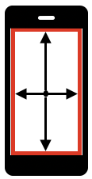

## Simple Screen swipe

Swipe has start and end points. The start point of swipe is most
important. The following elements may prevent swipe start:
- application interface/menu e.g. header or footer
- elements that are waiting tap and do not pass touch to scroll view

It is better to start swipe actions at the center of the screen to make
them more reliable.



```java
/**
 * Performs swipe from the center of screen
 *
 * @param dir the direction of swipe
 * @version java-client: 7.3.0
 **/
public void swipeScreen(Direction dir) {
    System.out.println("swipeScreen(): dir: '" + dir + "'"); // always log your actions

    // Animation default time:
    //  - Android: 300 ms
    //  - iOS: 200 ms
    // final value depends on your app and could be greater
    final int ANIMATION_TIME = 200; // ms

    final int PRESS_TIME = 200; // ms

    int edgeBorder = 10; // better avoid edges
    PointOption pointOptionStart, pointOptionEnd;

    // init screen variables
    Dimension dims = driver.manage().window().getSize();

    // init start point = center of screen
    pointOptionStart = PointOption.point(dims.width / 2, dims.height / 2);

    switch (dir) {
        case DOWN: // center of footer
            pointOptionEnd = PointOption.point(dims.width / 2, dims.height - edgeBorder);
            break;
        case UP: // center of header
            pointOptionEnd = PointOption.point(dims.width / 2, edgeBorder);
            break;
        case LEFT: // center of left side
            pointOptionEnd = PointOption.point(edgeBorder, dims.height / 2);
            break;
        case RIGHT: // center of right side
            pointOptionEnd = PointOption.point(dims.width - edgeBorder, dims.height / 2);
            break;
        default:
            throw new IllegalArgumentException("swipeScreen(): dir: '" + dir + "' NOT supported");
    }

    // execute swipe using TouchAction
    try {
        new TouchAction(driver)
                .press(pointOptionStart)
                // a bit more reliable when we add small wait
                .waitAction(WaitOptions.waitOptions(Duration.ofMillis(PRESS_TIME)))
                .moveTo(pointOptionEnd)
                .release().perform();
    } catch (Exception e) {
        System.err.println("swipeScreen(): TouchAction FAILED\n" + e.getMessage());
        return;
    }

    // always allow swipe action to complete
    try {
        Thread.sleep(ANIMATION_TIME);
    } catch (InterruptedException e) {
        // ignore
    }
}

public enum Direction {
    UP,
    DOWN,
    LEFT,
    RIGHT;
}
```


